# Omics-based Networks: Integrative Gene Function Analysis in Cancer

## Introduction / Background

Understanding gene function is crucial in cancer research, but accurately predicting gene roles remains challenging due to the complexity of regulatory mechanisms, protein interactions, and contextual dependencies in biological literature. Traditional approaches, which rely on experimental validation and single-modality computational methods, often fail to integrate the diverse biological signals required for comprehensive gene function annotation.

Recent advances include:
- **Enformer model**: Enhances gene expression prediction by capturing long-range regulatory interactions.
- **Large language models (LLMs)** (e.g., BioGPT, SciBERT): Extract contextual knowledge from literature, providing insights into gene-disease associations and molecular functions.

## Dataset Description

We utilized multi-modal biological data for human genes, including:
- **RNA-Seq profiles** from TCGA (gene expression)
- **DNA sequences** from GRCh38 regulatory context

**RNA-Seq data** provides normalized expression levels, while genomic and proteomic data offer complementary regulatory and functional features.

### Data Preparation and Download

- **RNA-seq data** was accessed from The Cancer Genome Atlas (TCGA) using the `TCGAbiolinks` R package.
- Focused on ovarian cancer (project ID: TCGA-OV), querying open-access RNA-seq data processed with the STAR workflow.
- Extracted both TPM (transcripts per million) counts and raw STAR counts from 429 studies.
- **TPM** was selected as the primary metric for analysis for effective comparison across samples.
- Genes with zero counts across all samples and those with low expression (total counts ≤ 10) were removed.
- The top 500 most variable genes were identified by calculating variance across genes and selecting those with the highest variability.
- Metadata for all samples was extracted and stored for further processing.

**Enformer analysis** used:
- `Homo_sapiens.GRCh38.dna.primary_assembly` FASTA file (reference genome)
- Corresponding GTF file (gene annotations)
- Both files obtained from the UCSC Genome Browser.

## Problem Definition

Classifying gene functions in cancer is challenging due to:
- **One-to-Many Problems**: A single gene may have multiple functions across different contexts.
- **Many-to-One Problem**: Different genes can share similar functions, but models often miss these redundancies.
- **Degenerate DNA Codes**: Many models ignore ambiguous nucleotide symbols (e.g., Y, S), reducing accuracy.

**Our Solution:**  
Build a multi-modal machine learning model that integrates diverse data sources to improve classification accuracy and uncover novel functional associations, capturing both contextual gene function and functional redundancy.

## Methods

### Preprocessing Techniques

- **Data Cleaning**: Remove low-expression genes, handle ambiguous DNA bases, ensure complete protein sequences.
- **Dimensionality Reduction**: Apply PCA or UMAP to reduce RNA-Seq variability and simplify protein/DNA embeddings.
- **Feature Engineering**: Use pretrained models (Enformer, ProteinBERT) for embeddings and engineer pathway-level features.

### Machine Learning Algorithms

- **K-Means (Unsupervised)**: Clusters genes into functional groups based on multi-modal embeddings.
- **Random Forest (Supervised)**: Classifies tumors into functional categories.
- **Gradient Boosting (Supervised)**: Handles non-linear relationships with strong performance.
- **SVM (Supervised)**: Assigns tumors in to classes progression categories.

---

## K-Means Implementation

- Applied K-means clustering to the 500 most variable genes.
- **Goal**: Identify co-expressed gene groups potentially driven by shared regulatory or functional mechanisms.

### Determining Optimal Clusters

- **Elbow Method**: Revealed an elbow at \( k = 3 \), suggesting diminishing returns beyond this point.
- **Silhouette Score**: Maximum at \( k = 3 \), indicating well-separated and cohesive clusters.

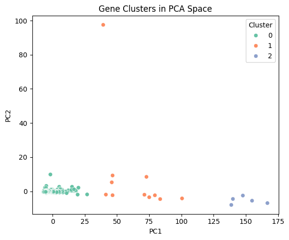

### Cluster Characterization

| Cluster | Enrichment/Functionality |
|---------|--------------------------|
| 0       | Cancer-related genes; immune activation, ECM organization, TNF signaling |
| 1       | Mitochondrial genes; core respiratory chain activities, ATP production |
| 2       | Mitochondrial assembly; electron transport chain, NADH dehydrogenase assembly |

#### Validation Metrics

- **Silhouette Score**: 0.924 (high, indicating dense and well-separated clusters)
- **Davies-Bouldin Index (DBI)**: 0.434 (low, indicating compact clusters and strong separation)

### Biological Interpretation

- **Cluster 0**: Enriched for post-transcriptional regulation, innate immunity, antigen presentation, ECM organization, and cancer-relevant pathways (e.g., TNF signaling, neutrophil-mediated immunity).
- **Cluster 1**: Enriched for mitochondrial ATP synthesis and electron transport chain (core metabolic output).
- **Cluster 2**: Focused on mitochondrial assembly and biogenesis processes.

---

## Functional Characterization via Gene Ontology (GO) Enrichment

- **Cluster 2**: Enriched for mitochondrial electron transport and ATP synthesis (oxidative phosphorylation).
  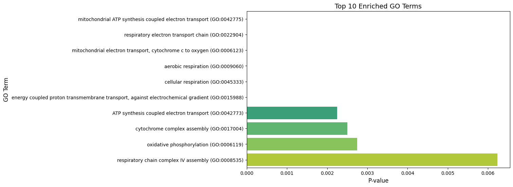
- **Cluster 1**: Enriched for core mitochondrial respiration and energy metabolism.
  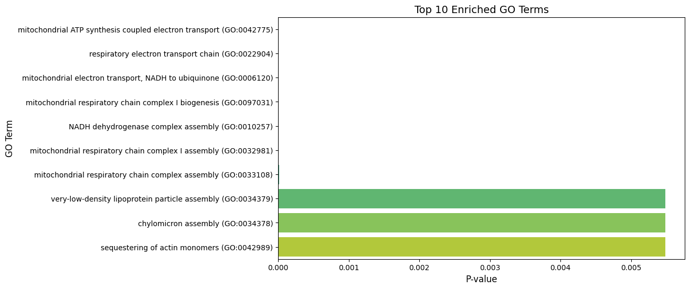
- **Cluster 0**: Enriched for mRNA stability, translation, rRNA processing, immune response, antigen presentation, and ECM organization.
  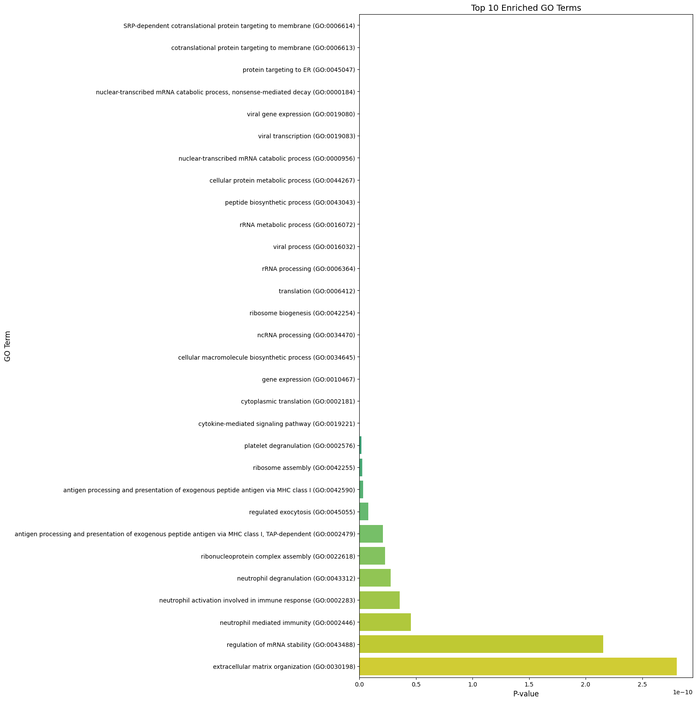

**Cancer-Relevant Signals in Cluster 0:**
- TNF signaling pathway (inflammatory/apoptotic signaling)
- Antigen presentation via MHC class I (immune surveillance)
- ECM organization (tumor progression/metastasis)
- Neutrophil-mediated immunity (tumor microenvironment)

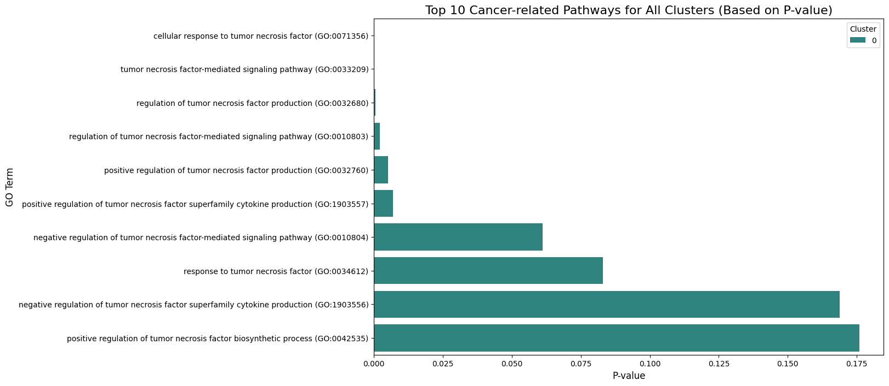
---

## Preprocessing for Supervised Learning

- Imported gene expression and metadata CSV files.
- Log2-transformed gene expression data for normalization.
- Numerically encoded categorical variables (including target variable `classification_of_tumor`).
- Standardized features and filtered rare classes (fewer than two samples).

---

## SVM Classification

- **Algorithm**: Support Vector Machine (SVM)
- **Purpose**: Predict tumor classification based on integrated gene expression and clinical metadata.
- **Data Split**: 80-20 split.
- **Performance**:
    - **Overall accuracy**: 87%
    - **Class 4**: Precision and recall of 1.00 (perfect classification)
    - **Class 5**: F1-score of 0.75
    - **Class 2**: F1-score of 0.53
    - **Class 3**: F1-score of 0.00
    - **Class 0**: No correct predictions
 

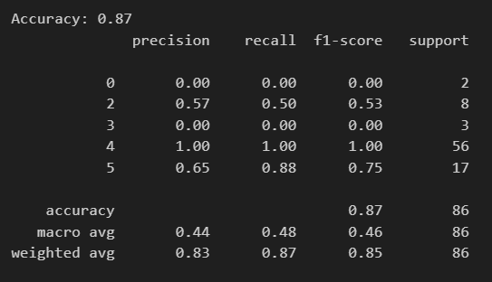

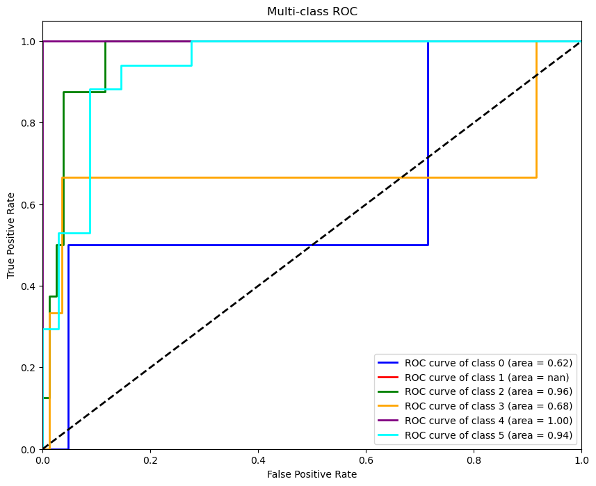

### Confusion Matrix Interpretation (SVM):

- Class 4 is perfectly classified, showing strong model confidence.
- Other classes show several false positives and false negatives.
- Class 0 is completely missed and consistently misclassified as class 5.
- Classes 2 and 3 tend to be misclassified as class 5, reflecting the imbalance in the dataset and the model’s tendency to favor the dominant classes.

### ROC-AUC Analysis (SVM):

- Class 4 stands out with a perfect AUC score of 1.0, showing strong separability.
- Classes 5 and 2 also perform well, with AUCs ranging from 0.90 to 1.0.
- Classes 0 and 3 show weaker performance, with AUC scores between 0.60 and 0.70.
- The ROC curves highlight the class imbalance.
  
---

## XGBoost Classification
- **Algorithm**: XGBoost
- **Purpose**: Predict tumor classification based on integrated gene expression data and clinical metadata.
- **Objective**: 'multi:softmax' (handling multiclass classification)
- **Data Split**: 80-20 split.
- **Performance**:
    - **Overall accuracy**: 97%
    - **Class 4**: Precision and recall of 1.0.
    - **Classes 2, 3, and 5**: F1-scores ranging from 0.80 to 0.94.
    - **Class 0**: Not classified accurately.

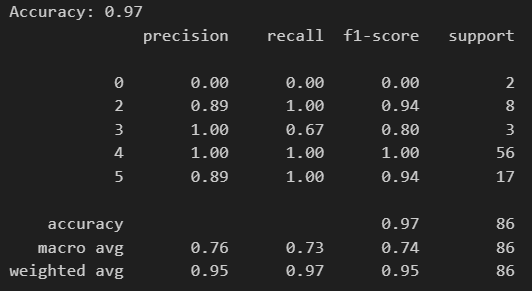
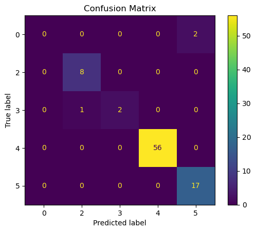
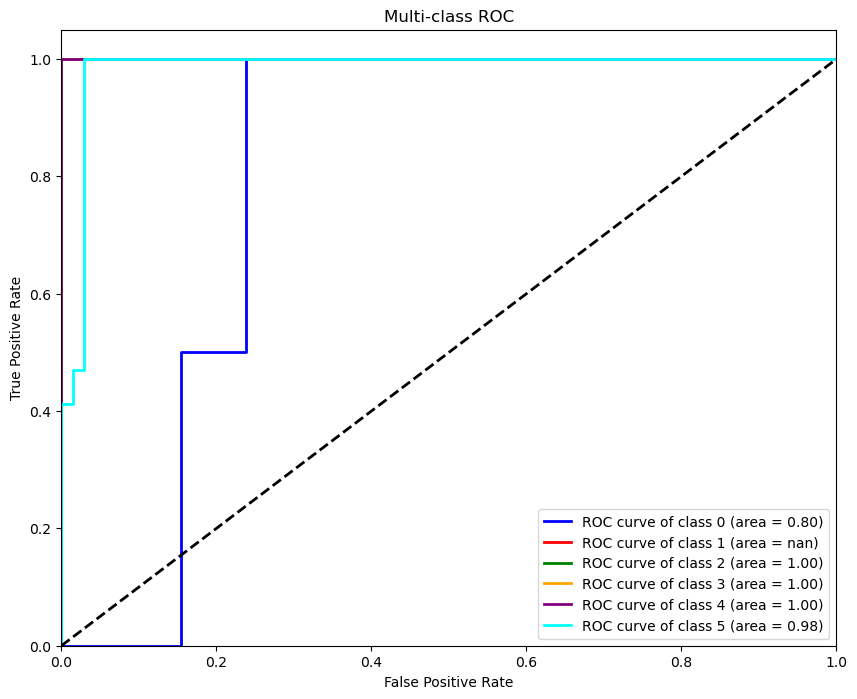

### Confusion Matrix Interpretation:

- Class 4 and 5 were accurately classified.
- Some instances of Class 0 were misclassified as Class 5, contributing to false positives for Class 5 and a slightly reduced recall.
- This reflects the imbalance in the dataset.

### ROC-AUC Analysis:

- Classes 2, 3, and 4 have a perfect score of 1.
- Class 5 has a score of 0.98 (likely due to false positives).
- Class 0 had a lower AUC of 0.80 with a jagged ROC curve, indicating inconsistent prediction performance.

---

## Random Forest Classification

- **Algorithm**: Random Forest Classifier
- **Purpose**: Classify tumor samples based on gene expression profiles and clinical metadata.
- **Data Split**: Stratified 80/20 train-test split.
- **Configuration**:
    - 200 trees (estimators)
    - Maximum tree depth of 10
    - Class balancing enabled
- **Performance**:
    - **Overall accuracy**: 86%
    - **Confusion Matrix**: (See below for interpretation)
    - **ROC-AUC**: (See below for interpretation)
 
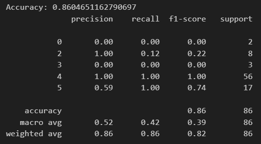
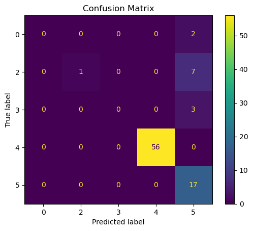
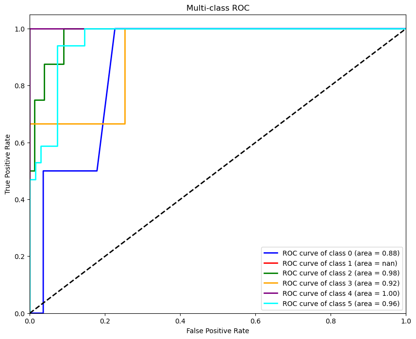

### Confusion Matrix Interpretation:

- Nearly all predictions for the majority class ("primary") are correct.
- Minority classes ("Progression" and "metastasis") are often missed or misclassified as the majority class.
- "Recurrence" is detected reliably, but the model tends to over-predict it.
- The matrix is highly imbalanced.

### ROC-AUC Analysis:

- **Class 4 ("primary")**: AUC likely near 1.0 (perfect separation).
- **Class 5 ("recurrence")**: AUC likely high (good distinction).
- **Classes 0, 2, 3 (minority classes)**: AUC likely near 0.5 (no better than random guessing).

---

## Discussion

- This study integrated genomic data with literature-derived insights to enhance gene function classification in ovarian cancer.
- Combined unsupervised clustering and supervised classification to uncover latent biological structures and tumor-specific gene programs.

- **Biological Context Integration:**
  - Enformer: Capture regulatory interactions and structural insights.

- **Insights:**
  - Unsupervised methods revealed underlying biological patterns.
  - Supervised methods enabled accurate phenotype prediction.
  - Class imbalance remains a challenge; future approaches should explore:
    - Advanced resampling methods.
    - Integration of additional biological context for rare tumor types.
    - Addition of more informative features

- **Sustainability and Ethics:**
  - Utilized publicly available datasets to reduce resource demands.
  - Applied transfer learning and dimensionality reduction for computational efficiency and lower environmental impact.
  - Maintained privacy by excluding personally identifiable information.
  - Acknowledged limitations in dataset diversity.

- **Future Directions:**
  - Enhance model interpretability with pathway-level integration.
  - Investigate advanced classification techniques to improve robustness and performance, especially for rare tumor types.

### Conclusion
Our integrative, multi-modal approach combining transcriptomic, genomic, and proteomic data with advanced machine learning methods effectively uncovers biologically meaningful gene clusters and accurately classifies tumor subtypes. The unsupervised clustering revealed distinct functional modules, including cancer-relevant and mitochondrial gene programs, while supervised models demonstrated high accuracy in tumor classification, laying the groundwork for further functional annotation and biomarker discovery in cancer research.

## References

[1] Vogelstein, B., Papadopoulos, N., Velculescu, V. E., Zhou, S., Diaz, L. A., Jr, & Kinzler, K. W. (2013). Cancer genome landscapes. *Science (New York, N.Y.)*, 339(6127), 1546–1558. [https://doi.org/10.1126/science.1235122](https://doi.org/10.1126/science.1235122)

[2] Greene, C. S., Tan, J., Ung, M., Moore, J. H., & Cheng, C. (2014). Big data bioinformatics. *Journal of cellular physiology*, 229(12), 1896–1900. [https://doi.org/10.1002/jcp.24662](https://doi.org/10.1002/jcp.24662)

[3] Avsec, Ž., Agarwal, V., Visentin, D. et al. (2021). Effective gene expression prediction from sequence by integrating long-range interactions. *Nat Methods*, 18, 1196–1203. [https://doi.org/10.1038/s41592-021-01252-x](https://doi.org/10.1038/s41592-021-01252-x)

[4] Brandes, N., Ofer, D., Peleg, Y., Rappoport, N., & Linial, M. (2022). ProteinBERT: A universal deep-learning model of protein sequence and function. *Bioinformatics*, 38(8), 2102–2110. [https://doi.org/10.1093/bioinformatics/btac020](https://doi.org/10.1093/bioinformatics/btac020)

[5] Luo, R., Sun, L., Xia, Y., et al. (2022). BioGPT: Generative Pre-trained Transformer for Biomedical Text Generation and Mining. *arXiv preprint arXiv:2210.10341*. [https://arxiv.org/abs/2210.10341](https://arxiv.org/abs/2210.10341)

[6] Beltagy, I., Lo, K., & Cohan, A. (2019). SciBERT: A Pretrained Language Model for Scientific Text. *arXiv preprint arXiv:1903.10676*. [https://arxiv.org/abs/1903.10676](https://arxiv.org/abs/1903.10676)

[7] National Cancer Institute, “Genomic Data Commons Data Portal,” 2025. [Online]. Available: [https://portal.gdc.cancer.gov/](https://portal.gdc.cancer.gov/). [Accessed: Feb. 21, 2025].

[8] Ensembl, “Homo sapiens - Genome assembly and annotation,” 2024. [Online]. Available: [https://useast.ensembl.org/Homo_sapiens/Info/Index?db=core](https://useast.ensembl.org/Homo_sapiens/Info/Index?db=core). [Accessed: Feb. 21, 2025].

## Gantt Chart
[View the Chart](https://gtvault-my.sharepoint.com/:x:/g/personal/ssuresh317_gatech_edu/EQj4-E6nTOVLtsVnny82GdoB655wx6uv04a6VxHP7BPTZw?e=K90yiM)

### Contributions Table

| Name            | Proposal Contribution             |
|---------------|---------------------------------|
| Khushi Vora   | SVM + XGB + Report        |
| Samyukta Singh | KMeans + Report |
| Sanjana Suresh | Data Preprocessing  + Report |
| Vikram Kaushik | RFC + Report |

