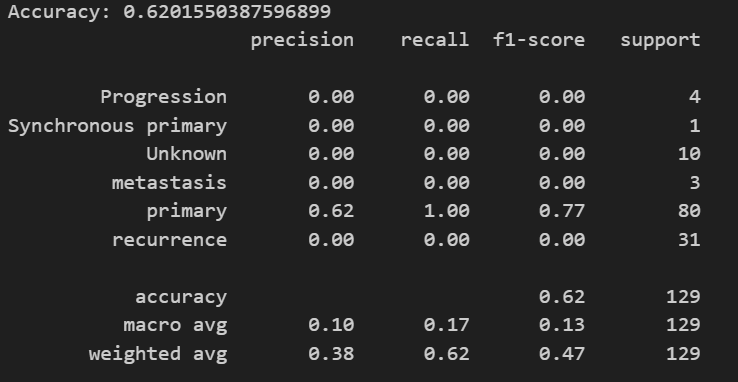
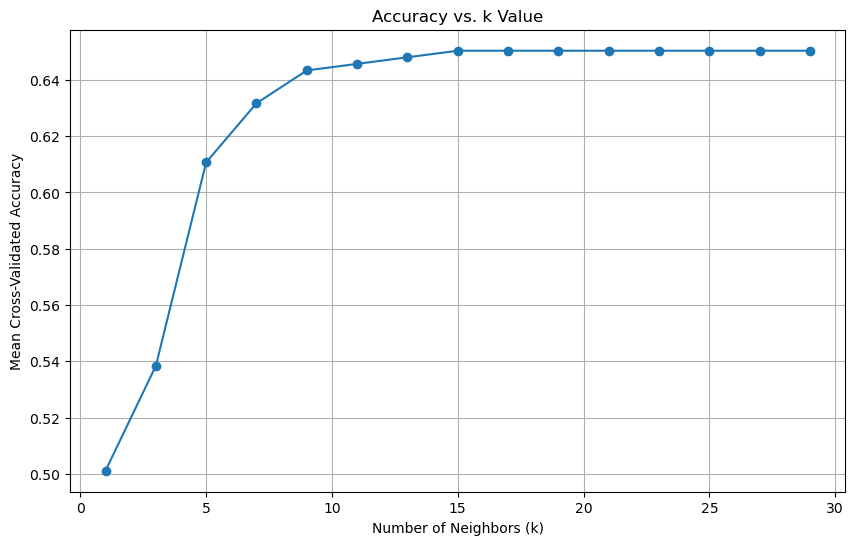
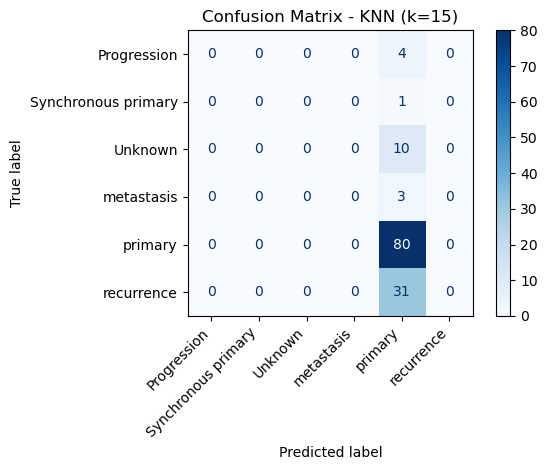
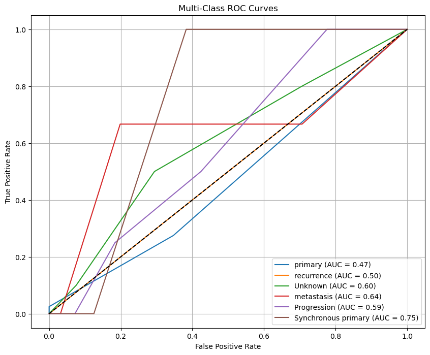

# P.R.O.T.O.N: Predicting Regulatory Outcomes with Transformers and Omics-based Networks

## Introduction/Background
Understanding gene function is important to cancer research, yet accurately predicting gene roles remains a challenge due to the complexity of regulatory mechanisms, protein interactions, and contextual dependencies in biological literature [1]. Traditional approaches rely on experimental validation and single-modality computational methods, which fail to integrate the diverse biological signals required for gene function annotation [2].  
The Enformer model [3] enhances gene expression prediction by capturing long-range regulatory interactions, while protein language models such as ProteinBERT [4] extract functional insights from amino acid sequences. Additionally, large language models (LLMs) like BioGPT [5] and SciBERT [6] extract knowledge from literature, offering contextual insights into gene-disease associations and molecular functions.  

## Dataset Description
We utilize multi-modal biological data for human genes, including:
- **RNA-Seq profiles** from TCGA (gene expression) [7]
- **DNA sequences** from GRCh38 regulatory context [8]
- **Protein sequences** from Ensembl (structural insights) [8]

RNA-Seq data provides normalized expression levels, while genomic and proteomic data offer complementary regulatory and functional features.

## Preparing and Downloading the Data
We utilized RNA-seq expression data from The Cancer Genome Atlas (TCGA) data portal. Using R and the `TCGAbiolinks` [9] package, we accessed and extracted data directly from the portal.

For this analysis, we focused on ovarian cancer (project ID: `TCGA-OV`). We queried the portal for RNA-seq data that is open-access and processed using the STAR workflow to generate counts [10]. From the 429 available studies, we extracted both TPM (transcripts per million) counts and raw STAR counts.

### Data Processing
- **Primary metric**: TPM (allows effective comparison across samples) [11].
- **Quality filtering**: Removed genes with zero counts across all samples and those with low expression (total counts ≤ 10).
- **Feature selection**: Identified the top 500 most variable genes by variance calculation.
- **Metadata extraction**: Stored separately for integration into downstream analyses.
- **Reference genome**: `Homo_sapiens.GRCh38.dna.primary_assembly` FASTA file and the corresponding GTF file (obtained from the UCSC Genome Browser).

## Problem Definition
Classifying gene functions in cancer is challenging due to the reliance on single-source models. Existing models struggle with:

- **One to Many Problem**: A single gene has multiple functions across different contexts, but most models fail to capture this variability.
- **Many To One Problem**: Different genes can share similar functions, yet models often miss these functional redundancies.
- **Degenerate DNA Codes**: Many models ignore ambiguous nucleotide symbols (e.g., Y, S), reducing accuracy in sequence-based predictions.

Our solution aims to build a **multi-modal ML model** that integrates diverse data sources to improve classification accuracy and uncover novel functional associations by capturing both **contextual gene function** and **functional redundancy**.

## Methods
### Preprocessing Techniques
- **Data Cleaning**: Remove low-expression genes, handle ambiguous bases in DNA, and ensure complete protein sequences.
- **Dimensionality Reduction**: Apply PCA or UMAP to reduce RNA-Seq variability and simplify protein/DNA embeddings.
- **Feature Engineering**: Use pretrained models (Enformer, ProteinBERT) for embeddings and engineer pathway-level features.

### Machine Learning Algorithms
- **Random Forest (Supervised)**: Classifies genes into functional categories using `Scikit-learn’s RandomForestClassifier`.
- **K-Means (Unsupervised)**: Clusters genes into functional groups using `Scikit-learn’s KMeans`.
- **Gradient Boosting (Supervised)**: Handles non-linear relationships using `XGBoost’s XGBClassifier`.
- **KNN (Supervised)**: Uses `Scikit-learn's KNeighborsClassifier` to classify samples.

### Implementation
#### **KNN Implementation**
- **Data sources**: Two CSV files containing gene expression data and sample metadata.
- **Classification target**: `classification_of_tumor` column.
- **Preprocessing**: Standardized gene expression values.
- **Model training**: Applied `KNeighborsClassifier`, split dataset into training and test sets.
- **Evaluation**: Classification accuracy and confusion matrix.

#### **Enformer Implementation**
- Extracted gene regions from the `GRCh38` reference genome.
- One-hot encoded sequences for model input.
- Leveraged **GPU acceleration** and **batch processing**.
- Generated gene expression predictions across **5,313 regulatory tracks**.

## Results
### Model Evaluation Metrics
- **Accuracy**: Measures overall correctness but may be misleading for imbalanced datasets.
- **Precision**: Avoids false positives, critical for accurate oncogene classification.
- **Recall**: Ensures no tumor suppressor genes are missed.
- **F1 Score**: Balances precision and recall.
- **Silhouette Score**: Evaluates cluster quality.

### KNN Performance
- **Optimal k-value**: k=15 achieved ~65% accuracy.

- **Confusion Matrix**:
  - Strong performance for "Primary" and "Recurrence" classifications.
  - Poor performance in "Synchronous primary" and "Metastasis" categories (class imbalance issue).
 

### ROC Curve Analysis
- **Best Performance**: "Synchronous primary" (AUC = 0.75).
- **Worst Performance**: "Primary" (AUC = 0.47).
- **Moderate Performance**: "Metastasis" (AUC = 0.64), "Progression" (AUC = 0.59).

## Discussion
### Challenges
- **Class imbalance**: Oversampling or undersampling needed.
- **Feature representation**: More informative features required.
- **Alternative classifiers**: Random Forest and Gradient Boosting may improve performance.

### Biological Context Integration
- **Enformer + ProteinBERT embeddings**: Capture regulatory interactions and structural insights.
- **Pathway enrichment analysis**: Validate model predictions with known biological mechanisms.

### Sustainability & Ethical Considerations
- **Open datasets**: Minimized resource consumption.
- **Computational efficiency**: Optimized with transfer learning and dimensionality reduction.
- **Privacy**: Safeguarded personally identifiable information.
- **Dataset diversity**: Acknowledged as a limitation.

### Conclusion
- **ML methods show promise but require biological context for accuracy.**
- **Future work**: Integrate pathway insights and test alternative classifiers.

## References

[1] Vogelstein, B., Papadopoulos, N., Velculescu, V. E., Zhou, S., Diaz, L. A., Jr, & Kinzler, K. W. (2013). Cancer genome landscapes. *Science (New York, N.Y.)*, 339(6127), 1546–1558. [https://doi.org/10.1126/science.1235122](https://doi.org/10.1126/science.1235122)

[2] Greene, C. S., Tan, J., Ung, M., Moore, J. H., & Cheng, C. (2014). Big data bioinformatics. *Journal of cellular physiology*, 229(12), 1896–1900. [https://doi.org/10.1002/jcp.24662](https://doi.org/10.1002/jcp.24662)

[3] Avsec, Ž., Agarwal, V., Visentin, D. et al. (2021). Effective gene expression prediction from sequence by integrating long-range interactions. *Nat Methods*, 18, 1196–1203. [https://doi.org/10.1038/s41592-021-01252-x](https://doi.org/10.1038/s41592-021-01252-x)

[4] Brandes, N., Ofer, D., Peleg, Y., Rappoport, N., & Linial, M. (2022). ProteinBERT: A universal deep-learning model of protein sequence and function. *Bioinformatics*, 38(8), 2102–2110. [https://doi.org/10.1093/bioinformatics/btac020](https://doi.org/10.1093/bioinformatics/btac020)

[5] Luo, R., Sun, L., Xia, Y., et al. (2022). BioGPT: Generative Pre-trained Transformer for Biomedical Text Generation and Mining. *arXiv preprint arXiv:2210.10341*. [https://arxiv.org/abs/2210.10341](https://arxiv.org/abs/2210.10341)

[6] Beltagy, I., Lo, K., & Cohan, A. (2019). SciBERT: A Pretrained Language Model for Scientific Text. *arXiv preprint arXiv:1903.10676*. [https://arxiv.org/abs/1903.10676](https://arxiv.org/abs/1903.10676)

[7] National Cancer Institute, “Genomic Data Commons Data Portal,” 2025. [Online]. Available: [https://portal.gdc.cancer.gov/](https://portal.gdc.cancer.gov/). [Accessed: Feb. 21, 2025].

[8] Ensembl, “Homo sapiens - Genome assembly and annotation,” 2024. [Online]. Available: [https://useast.ensembl.org/Homo_sapiens/Info/Index?db=core](https://useast.ensembl.org/Homo_sapiens/Info/Index?db=core). [Accessed: Feb. 21, 2025].

## Gantt Chart
[View the Chart](https://gtvault-my.sharepoint.com/:x:/g/personal/ssuresh317_gatech_edu/EQj4-E6nTOVLtsVnny82GdoB655wx6uv04a6VxHP7BPTZw?e=K90yiM)

### Contributions Table

| Name            | Proposal Contribution             |
|---------------|---------------------------------|
| Khushi Vora   | Supervised model code + Report        |
| Samyukta Singh | Enformer implementation + Report |
| Sanjana Suresh | Data Preprocessing  + Report |
| Vikram Kaushik | KNN implementation + Report |

